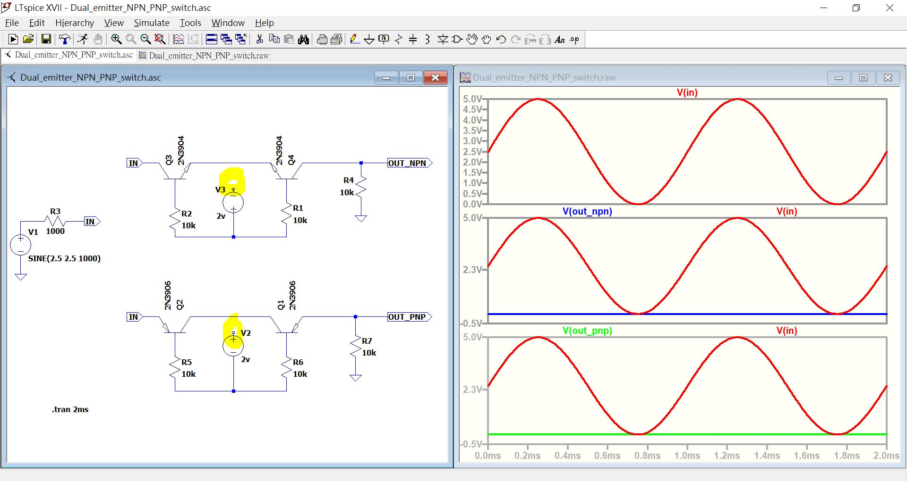
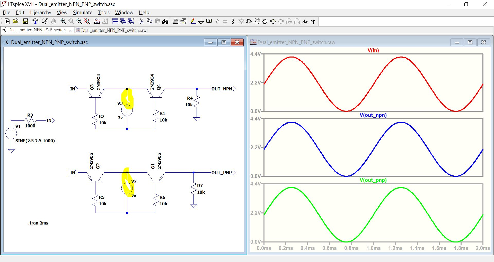

# LTspice_NPN-pair_PNP-pair_analog_switch
patented in year 196x, circuit to be learned  

Analog multiplexer, 3N68  
Analog switch  

四只腳的 TRANSISTOR, 有兩個發射極, 其實是兩個 PNP 合體, 據猜測是有人不小心對調了兩個晶體管的 EC腳, 發現兩隻E腳之間的導通電壓更小, 速度更快, 形成更好的 “開關", 但是並沒有任何放大的能力. 所以1954年申請了專利, 然後有人把它生產了 3N68 晶體管, 又有人把它用在登月計畫APOLLO的機器設計裡面 (PCM_PRIMARY_MULTIPLEXER_GATE), 共有150個這樣的 “模擬多工器" 連接到 ADC .  

介紹雙射極晶體管的秘密,  
https://pa3fwm.nl/technotes/tn37-dual-emitter-transistors.html  

Motorola AN-0470_Bipolar_Chopper_Transistors_And_Circuits.pdf  
http://www.bitsavers.org/components/motorola/_appNotes/AN-0470_Bipolar_Chopper_Transistors_And_Circuits.pdf  


NPN-pair or PNP-pair, analog switch, 曾有專利.
前人介紹的開關, 據說60/70年代NASA登月艙數據傳送電路有使用.
CD4066 等 CMOS switch 還沒出現前就一直使用, 7400 TTL logic gate 輸入就是代表作.
主打 兩只發射極 (E腳) 的晶體管 或者 兩只一樣的晶體管


  

    

[Dual_emitter_NPN_PNP_switch.asc](Dual_emitter_NPN_PNP_switch.asc)  


source code in text  


```
Version 4
SHEET 1 924 900
WIRE -16 128 -64 128
WIRE 320 128 80 128
WIRE 592 128 416 128
WIRE 672 128 592 128
WIRE 592 160 592 128
WIRE 368 240 368 192
WIRE 32 256 32 192
WIRE 592 288 592 240
WIRE -368 304 -432 304
WIRE -240 304 -288 304
WIRE -432 336 -432 304
WIRE 32 352 32 336
WIRE 208 352 208 288
WIRE 208 352 32 352
WIRE 368 352 368 320
WIRE 368 352 208 352
WIRE -432 464 -432 416
WIRE -16 592 -64 592
WIRE 320 592 80 592
WIRE 576 592 416 592
WIRE 672 592 576 592
WIRE 576 640 576 592
WIRE 32 704 32 656
WIRE 368 704 368 656
WIRE 576 768 576 720
WIRE 32 816 32 784
WIRE 208 816 208 720
WIRE 208 816 32 816
WIRE 368 816 368 784
WIRE 368 816 208 816
FLAG -432 464 0
FLAG 592 288 0
FLAG 672 128 OUT_NPN
IOPIN 672 128 Out
FLAG -240 304 IN
IOPIN -240 304 Out
FLAG -64 128 IN
IOPIN -64 128 In
FLAG -64 592 IN
IOPIN -64 592 In
FLAG 576 768 0
FLAG 672 592 OUT_PNP
IOPIN 672 592 Out
SYMBOL res 352 224 R0
SYMATTR InstName R1
SYMATTR Value 10k
SYMBOL res 16 240 R0
SYMATTR InstName R2
SYMATTR Value 10k
SYMBOL res -272 288 R90
WINDOW 0 0 56 VBottom 2
WINDOW 3 32 56 VTop 2
SYMATTR InstName R3
SYMATTR Value 1000
SYMBOL res 608 256 R180
WINDOW 0 36 76 Left 2
WINDOW 3 36 40 Left 2
SYMATTR InstName R4
SYMATTR Value 10k
SYMBOL voltage -432 320 R0
WINDOW 123 0 0 Left 0
WINDOW 39 0 0 Left 0
SYMATTR InstName V1
SYMATTR Value SINE(2.5 2.5 1000)
SYMBOL npn -16 192 R270
SYMATTR InstName Q3
SYMATTR Value 2N3904
SYMBOL npn 416 192 M270
SYMATTR InstName Q4
SYMATTR Value 2N3904
SYMBOL voltage 208 304 R180
WINDOW 0 24 96 Left 2
WINDOW 3 24 16 Left 2
WINDOW 123 0 0 Left 0
WINDOW 39 0 0 Left 0
SYMATTR InstName V3
SYMATTR Value 2v
SYMBOL pnp 320 656 R270
SYMATTR InstName Q1
SYMATTR Value 2N3906
SYMBOL pnp 80 656 M270
SYMATTR InstName Q2
SYMATTR Value 2N3906
SYMBOL voltage 208 624 R0
WINDOW 123 0 0 Left 0
WINDOW 39 0 0 Left 0
SYMATTR InstName V2
SYMATTR Value 2v
SYMBOL res 16 688 R0
SYMATTR InstName R5
SYMATTR Value 10k
SYMBOL res 352 688 R0
SYMATTR InstName R6
SYMATTR Value 10k
SYMBOL res 560 624 R0
SYMATTR InstName R7
SYMATTR Value 10k
TEXT -338 870 Left 2 !.tran 2ms

```
